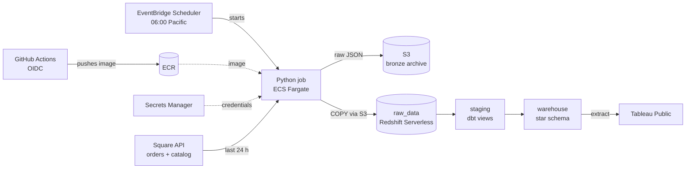
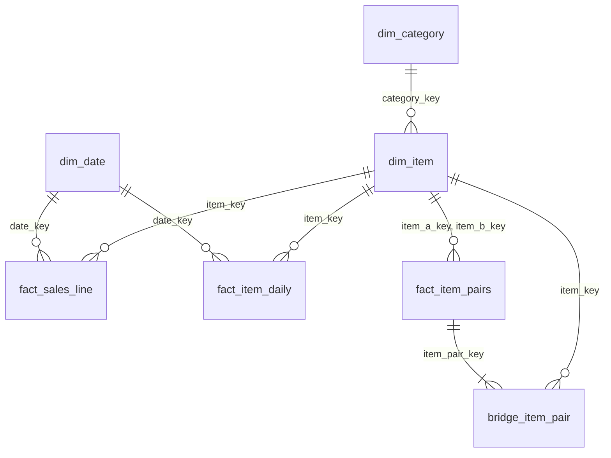

# Convention Sales Warehouse

[](https://github.com/cadenwo/convention-sales-warehouse/actions/workflows/deploy.yml)


A reusable sales warehouse for my convention booth. Each convention I vend at runs
through the same ELT pipeline and lands as its own event, with no code changes;
Sakura-Con 2026 is the first. Python pulls orders from the Square API, archives the
raw JSON to S3, and loads Redshift Serverless; dbt builds and tests a star schema;
the job runs daily as a container on ECS Fargate, deployed by GitHub Actions. Currently, two public Tableau dashboards sit on top.


| Live dashboard | |
|---|---|
| Sales: revenue trend, category share, product totals | [Tableau Public](https://public.tableau.com/app/profile/caden.wong/viz/SakuraConSalesDashboard/SalesDashboard) |
| Analytics: daily sales, popularity changes, peak hours, bundles | [Tableau Public](https://public.tableau.com/app/profile/caden.wong/viz/SakuraConSalesDashboard/AnalyticsDashboard) |

---

## Why this project

> What sold out, when did the rush hit, and what do people buy together?

I sell at conventions, and the booth's card sales live in Square. Those questions
decide what to restock and what to bundle next year, and a Square export makes
them awkward to answer.

The data is small so far: one three-day convention (Sakura-Con, April 3–5 2026), 82 card
transactions. Cash sales, roughly half the booth's takings, never enter Square and
are out of scope. Postgres and a cron job would have handled this volume. I used
Redshift, dbt, and Fargate deliberately, to learn the stack a production data team
runs, and because Redshift Serverless and Fargate bill compute only while a job is
running, that choice costs very little (see [Cost](#cost)). The decisions that
matter here are the ones that would matter at any size: loads that are safe to
re-run, models that are tested on every run, and no credentials in code.

## What it measures

Units and revenue answer different questions: blindbags are the volume line,
handmade goods bring in the most money. The dashboards show both. Revenue appears
as an index (Day 1 = 100) or as a share of the total; absolute figures stay out of
this repository and the public dashboards.

---

## Architecture



The layers map onto the medallion pattern: `raw_data` and the S3 archive are
bronze, `staging` is silver, and the `warehouse` star schema is gold.

### One sale, end to end

1. **Start.** EventBridge Scheduler launches the task on Fargate at 06:00 Pacific.
   The container reads its Square token and database credentials from Secrets
   Manager.
2. **Extract.** Python requests the last 24 hours of completed orders from the
   Square Orders API, following page cursors and retrying on rate limits, along
   with the catalog (item names and categories) and the location's timezone, so a
   UTC timestamp becomes a local sale time.
3. **Archive.** The untouched response is gzipped to S3 under `extracted_date=`
   partitions. It still contains card suffixes and customer names, so the bucket
   is private and versioned, and nothing personal goes any further.
4. **Load.** Orders are flattened to one row per line item, converted from cents,
   and loaded into `raw_data.sales_line_items`. In one transaction, the rows for
   the batch's dates are deleted and the batch is `COPY`-ed in, so a retried run
   never double-counts and a failed load leaves the previous rows in place. The
   batch is staged to S3 first, because Redshift's `COPY` can't read from the
   client connection.
5. **Transform.** `dbt build` creates the staging view and the star schema and runs
   every test. Any failure exits non-zero, and the run shows as failed.
6. **Visualize.** Tableau read the `warehouse` schema, and the dashboards were
   published to Tableau Public as an extract: a snapshot, refreshed by
   republishing.

The pipeline was built after Sakura-Con 2026, so that event was loaded with a
one-time backfill (`--backfill --init`). The daily schedule picks up conventions
from here on.

---

## Data model



| Table | Grain |
|---|---|
| `fact_sales_line` | One line item within an order |
| `fact_item_daily` | One item × one trading day, including days it sold nothing |
| `fact_item_pairs` | One unordered pair of items bought together, per convention |
| `bridge_item_pair` | One row per item per pair (two per pair) |
| `dim_date` | One date with sales: whether it was a trading day, which convention, and Day 1/2/3 |
| `dim_item` | One sellable item, keyed on `COALESCE(sku, item_name)` because some line items have no SKU |
| `dim_category` | One category, including an explicit `Uncategorized` member |

### Design decisions

**Zero-filled item-by-day facts.** `fact_sales_line` has no row for an item that
didn't sell, so a day-over-day change returns null exactly where the biggest drops
are. `fact_item_daily` crosses every item with every trading day and fills the gaps
with zero. That is only valid because the sales table is a complete record of those
days, and it is what made the top-revenue item's drop to zero on Day 3 visible.

**Trading days derived from the catalog.** A pre-convention card-reader test would
otherwise show up as a fourth convention day. A date counts as trading only if it
took at least the price of the cheapest catalog item, and a gap of more than seven
days between trading days starts a new convention, so the next event arrives as
Event 2, numbered from its own Day 1, with no code change.

**Copied labels are tested against their source.** The item-by-day and pairs tables
carry item and event names, so a chart can use them without joining the
dimensions. Every copy has a test that re-joins it to its dimension, because a
stale label renders perfectly and says the wrong thing.

**Basket pairs, stored once and per convention.** Pairs are kept in one direction
(`a.item_key < b.item_key`) so A+B and B+A aren't counted twice, and the convention
is part of the grain so two events never merge. Because the stored order is
arbitrary, filtering by item goes through `bridge_item_pair`. A dbt unit test proves
the per-convention behavior on fixture rows, since the real data holds one
convention and can't.

**Built for a cold warehouse.** A once-a-day job always meets an idle Redshift
Serverless; after three idle weeks it took 25 seconds to accept a connection. The
original 15-second timeout would have failed every scheduled run. The connection
now allows 60 seconds and retries only on cold-start errors, so a wrong password
still fails immediately.

---

## Testing

Every run executes `dbt build`: 8 models, 79 data tests, and 1 unit test. Any
failure fails the run.

- **Keys:** unique and not-null on every surrogate key.
- **Referential integrity:** Redshift doesn't enforce foreign keys, so
  `relationships` tests do, on every build.
- **Reconciliation:** revenue must match from the raw table through staging to
  `fact_sales_line`, and row counts from staging to the fact. Densifying must not
  add or lose revenue, and `fact_item_daily` must hold exactly one row per item
  per trading day.
- **Invariants:** every convention day clears the catalog floor; pairs are
  unordered; each pair resolves to exactly its two items through the bridge;
  categories are case-normalized; quantities are non-negative.
- **Unit test:** `pairs_stay_within_their_event` runs the pairs model on hand-written
  rows covering two conventions, a duplicated scan, and a non-trading day.

The extract and archive layers have offline pytest suites that fake every Square
and S3 response, so they run in CI with no credentials.

## Infrastructure

- **Serverless, scheduled compute.** EventBridge Scheduler starts the task on ECS
  Fargate at 06:00 Pacific and retries a failed launch up to twice. Nothing runs
  between jobs.
- **Least-privilege IAM.** The execution role can only pull the image and write
  logs; the task role can read one secret and read and write one S3 bucket. The
  scheduler can start only this task family and pass only its two roles, and only
  to ECS (`iam:PassedToService`); the deployer policy can attach only the ECS
  execution policy (`iam:PolicyARN`).
- **No stored AWS keys.** GitHub Actions assumes a deploy role through OIDC.
- **Private warehouse.** Fargate reaches Redshift through a security-group rule,
  so the public endpoint stays off. It's switched on only for a live Tableau
  Desktop connection, limited to allowlisted IPs.
- **Traceable images.** Images are tagged with their git commit, never `:latest`,
  in an ECR repository with immutable tags and a lifecycle policy. Logs are kept
  for 30 days in CloudWatch.
- **Re-runnable scripts.** `infra/01`–`05` provision everything except the S3
  bucket and the Redshift workgroup, which are created once by hand
  ([`docs/AWS_SETUP.md`](docs/AWS_SETUP.md)).

### CI/CD

Every push to `main` and every pull request against it runs the pytest suites and
`dbt parse`. A push to `main` that passes then builds the image for `linux/amd64`,
pushes it to ECR, and registers a new task-definition revision, which the schedule
picks up on its next run. Earlier revisions stay registered, so rolling back means
pointing the schedule at an older one.

## Cost

Measured in Cost Explorer with credits excluded, September came to **$4.05**, and
89% of it was a public IPv4 address on the warehouse that the pipeline never
needed. Public access is now off, and base capacity is down from 16 to 4 RPU, which
took the dbt build from 17.8 to 22.2 seconds. What remains is Secrets Manager at
$0.40 a month, storage, and compute billed only while a run is active.

---

## What Sakura-Con 2026 showed


- **Handmade goods brought in 30% of revenue;** blindbags were the volume line, at
  48 of 126 units.
- **The top-revenue item sold out on Day 2:** 5 units on Day 1, 4 on Day 2, none
  on Day 3.
- **Pikmin Ver 1 blindbags sold 13 on Day 3**, more than double Day 2.
- **Demand peaked at 1 PM.**
- **The most common pair was the two Pikmin blindbag versions**, bought together in
  3 baskets, which makes them the obvious bundle.

---

## Running it

You need an AWS account, a Square access token, Python 3.11, Docker, and the AWS
CLI.

1. Create the S3 bucket and the Redshift Serverless workgroup:
   [`docs/AWS_SETUP.md`](docs/AWS_SETUP.md).
2. Copy `.env.example` to `.env` and fill it in. `.env` is gitignored.
3. Attach `infra/deployer-policy.json` to the IAM user that will deploy;
   [`docs/DEPLOY.md`](docs/DEPLOY.md) has the commands, which fill in your account
   ID. Then provision, deploy, run the first full load on Fargate, and schedule the
   daily run:

   ```bash
   ./infra/01_provision.sh
   ./infra/02_deploy_task.sh
   ./infra/03_run_once.sh --backfill --init
   ./infra/04_schedule.sh
   GITHUB_REPO=your-user/convention-sales-warehouse ./infra/05_github_oidc.sh
   ```

   | Script | What it does |
   |---|---|
   | `infra/01_provision.sh` | ECR, Secrets Manager, IAM roles, log group, cluster, Redshift ingress rule |
   | `infra/02_deploy_task.sh` | Build the image, push it, register the task definition |
   | `infra/03_run_once.sh` | Run the task once and tail its logs |
   | `infra/04_schedule.sh` | Create the daily EventBridge schedule |
   | `infra/05_github_oidc.sh` | Let CI deploy without stored AWS keys |

To run the pipeline from your own machine instead, install `requirements.txt` and
run `python scripts/run_pipeline.py --backfill --init`. That needs the warehouse's
public endpoint switched on and limited to your IP.

The offline tests need no credentials:

```bash
pip install -r requirements.txt -r requirements-dev.txt
python -m pytest tests/ -v
```

## Repository layout

```
├── src/                 Square extraction, S3 archive, configuration
├── scripts/             run_pipeline.py (the entrypoint) and utilities
├── sql/                 raw-layer DDL and analysis queries
├── dbt/                 staging and warehouse models, tests, macros
├── tests/               offline pytest suites
├── infra/               provisioning, deploy, schedule, and OIDC scripts
├── docs/                setup and deployment guides, dashboard screenshots
├── .github/workflows/   CI and deploy
└── Dockerfile           multi-stage build, runs as a non-root user
```

## Future work

- **Script the last two resources.** The S3 bucket and the Redshift workgroup are
  still created by hand. Scripting them, or moving `infra/` to Terraform, would let
  the whole stack rebuild from code.
- **Replay from the archive.** The S3 archive is write-only today, so recovering the
  warehouse means re-extracting from Square. Rebuilding from the archive would
  remove that dependency.
- **Align the extract window to whole days.** The 06:00 run always covers complete
  sale dates, because the booth doesn't trade overnight. A manual 24-hour run
  started mid-day would replace yesterday's rows with only the hours inside its
  window, so manual runs use `--backfill` for now; snapping the window to local
  midnight would remove that rule.
- **Finish the bundle filters in Tableau.** The bridge table and per-convention pairs
  are built and tested; wiring them into the dashboard waits for the next
  convention's data refresh.

## License

MIT. See [`LICENSE`](LICENSE).
