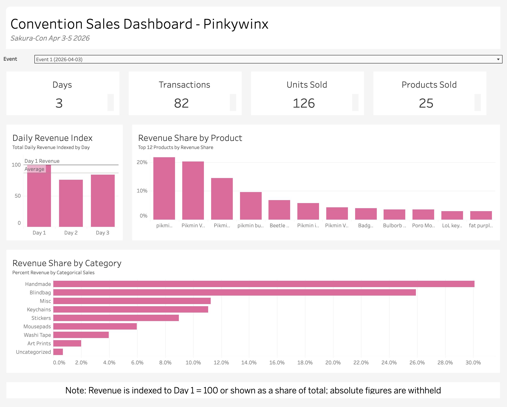
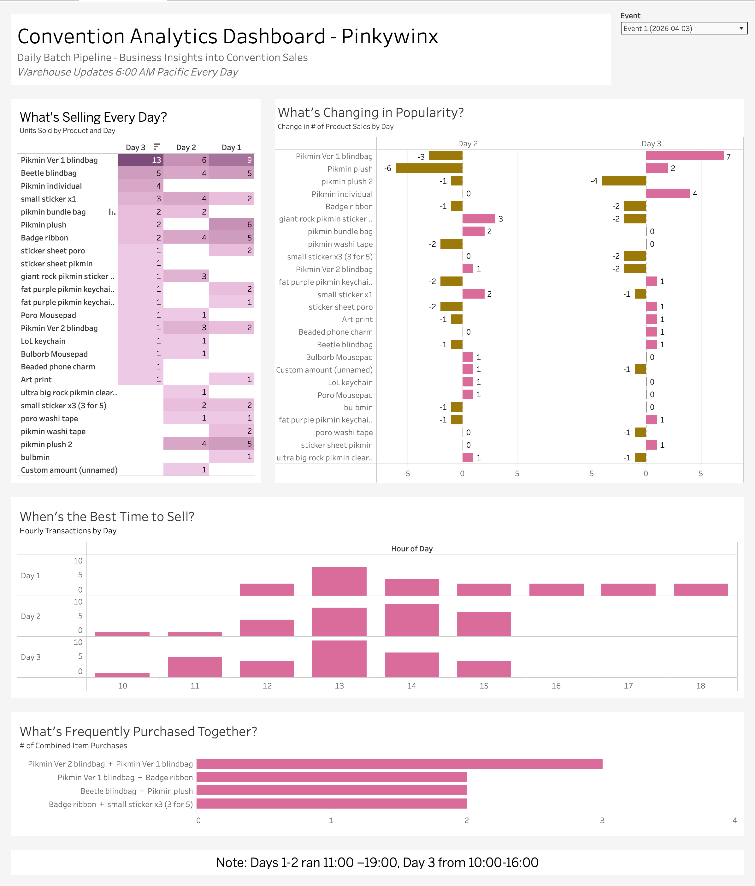

# Dashboards

Two Tableau Public dashboards sit on top of the warehouse. **Sales** reports what
happened. **Analytics** says what to change at the next convention. Screenshots
are in [`dashboards/`](../dashboards), named by convention.

| Dashboard | Question it answers | Live |
|---|---|---|
| Sales | What sold, and how did each day compare? | [Tableau Public](https://public.tableau.com/app/profile/caden.wong/viz/SakuraConSalesDashboard/SalesDashboard) |
| Analytics | What should change next time: stock, timing, bundles? | [Tableau Public](https://public.tableau.com/app/profile/caden.wong/viz/SakuraConSalesDashboard/AnalyticsDashboard) |

## Ground rules

Settled before building anything, because both dashboards are public.

- **Revenue is never absolute.** Every revenue figure is a share of the total or
  an index (Day 1 = 100). Item names, units, times, and rankings stay as they
  are; the totals are what stay private.
- **Tooltips are checked by hand.** Tableau's default tooltip shows the
  underlying measure, so a perfectly indexed chart can still show the dollar
  amount on hover. Every tooltip on both dashboards was checked for that.
- **Transactions, not customers.** Customer fields are dropped at ingestion, so
  there is no way to tell 82 transactions by 82 people from 60 people who came
  back. Every tile and axis says transactions.
- **Some fields never leave the warehouse.** `location_id` and `device_name_key`
  feed no chart, so the export script drops them before the data reaches
  Tableau.
- **A snapshot, not a live feed.** Tableau Public needs an extract, and download
  is turned off. The workbook itself isn't in this repository: a packaged
  workbook embeds its extract, and with it the revenue.

## Sales: what happened



- **Tiles:** days, transactions, units sold, and products sold, the four numbers
  that frame everything below them.
- **Daily revenue index:** each day against Day 1 = 100, with reference lines for
  Day 1 and the average. A reader sees the shape of the convention without
  seeing the takings.
- **Revenue share by product:** the top 12. The question is what carries the
  revenue, and a long tail of sub-1% items adds rows without adding an answer.
  Every item appears on the analytics dashboard, where the tail matters.
- **Revenue share by category:** the category mix, handmade goods first.
- **Caption:** states the indexing rule on the page, so a share is never read as
  a dollar figure.

## Analytics: what to change next time



- **What's selling every day?** Units by item and day, as a heatmap on a single
  light-to-dark ramp. Sequential data gets one color family; a rainbow would
  invent boundaries the data doesn't have.
- **What's changing in popularity?** Each item's change in units against the day
  before. It reads from `fact_item_daily`, which keeps a zero row for every item
  that didn't sell, so an item that drops to zero shows a full decline instead
  of vanishing from the chart.
- **Those two sit side by side on purpose.** A big decline can mean demand fell
  or stock ran out, and those call for opposite decisions. The heatmap tells
  them apart: the top-revenue item sold nothing on Day 3 because it had sold
  out, not because people stopped wanting it.
- **When's the best time to sell?** Transactions by hour, one row per day. The
  caption gives each day's hours, since Day 3 closed earlier and its quiet late
  afternoon is the hall closing, not a slump. The hour is computed in the
  warehouse (`hour_of_day`) because Redshift won't cast a time to a timestamp,
  so Tableau's date functions fail on it.
- **What's frequently purchased together?** The item pairs bought together most
  often, counted in baskets, from `fact_item_pairs`.

## One convention at a time

An **Event** dropdown sits on both dashboards. It's a parameter whose list
refreshes from the data each time the workbook opens, so a new convention shows
up without editing the workbook. Calculated filters apply it to every sheet
built on `fact_sales_line` and to the popularity chart; the pairs chart joins
at the next refresh. The card-reader test before the convention is labelled
"Non-trading day", so it never matches an event and never appears.

There's no sales-by-convention chart yet. With one event it would be a single
bar, so it waits for the second convention.

## Interactivity

Three dashboard actions link the analytics panels by item, day, and hour. The
pairs chart is left out of them: it has no day or hour, and an item filter on a
pairs table matches only one side of each pair. `bridge_item_pair` gives each
item in a pair its own row, which fixes that, and it gets wired in at the next
refresh.

## Calculations

The revenue figures and the popularity change are table calculations:

```
Revenue Share              SUM([Net Sales]) / TOTAL(SUM([Net Sales]))
Revenue Index (Day 1=100)  SUM([Net Sales]) / LOOKUP(SUM([Net Sales]), FIRST()) * 100
Unit Change vs Prior Day   SUM([Quantity]) - LOOKUP(SUM([Quantity]), -1)
```

`Direction` labels each change as gained, declined, no change, or no prior day,
and it checks for a missing value first. Without that check, a table
calculation that fails to compute falls through to "no change", a fault that
looks exactly like a finding.

Day 1 is hidden on the popularity chart rather than filtered out. A filter
removes rows before table calculations run, which would leave Day 2 nothing to
compare against.

## Color

- **Pink `#D96C9C`** is the primary mark, and marks gains in the popularity
  chart.
- **Gold `#9C7A0A`** marks declines. Pink and teal was the obvious pair, but
  under red-green color blindness both fade toward the same blue-grey. Gold
  sits on the blue-yellow axis, which stays intact, so gains and declines stay
  distinct for color-blind readers.
- **The heatmap** uses one color ramp, light to dark.
- **Backgrounds and text** can be pale. They carry no data.

## Refreshing for the next convention

1. The daily run, or `./infra/03_run_once.sh --backfill`, loads the new sales,
   and `dim_date` numbers the convention as its own event.
2. Export the warehouse tables to CSV, either from Redshift Query Editor v2 in
   the AWS console or with `scripts/export_star_schema.py`. The script needs the
   warehouse's public access on for a few minutes, limited to your IP. Tableau
   Public can't connect to Redshift directly.
3. Point the workbook at the new CSVs, set **Event** to the new convention, wire
   the pairs chart to the bridge and the event filter, and republish.
4. Save the screenshots in `dashboards/` as
   `<convention>-<year>-sales-dashboard.png` and
   `<convention>-<year>-analytics-dashboard.png`.
